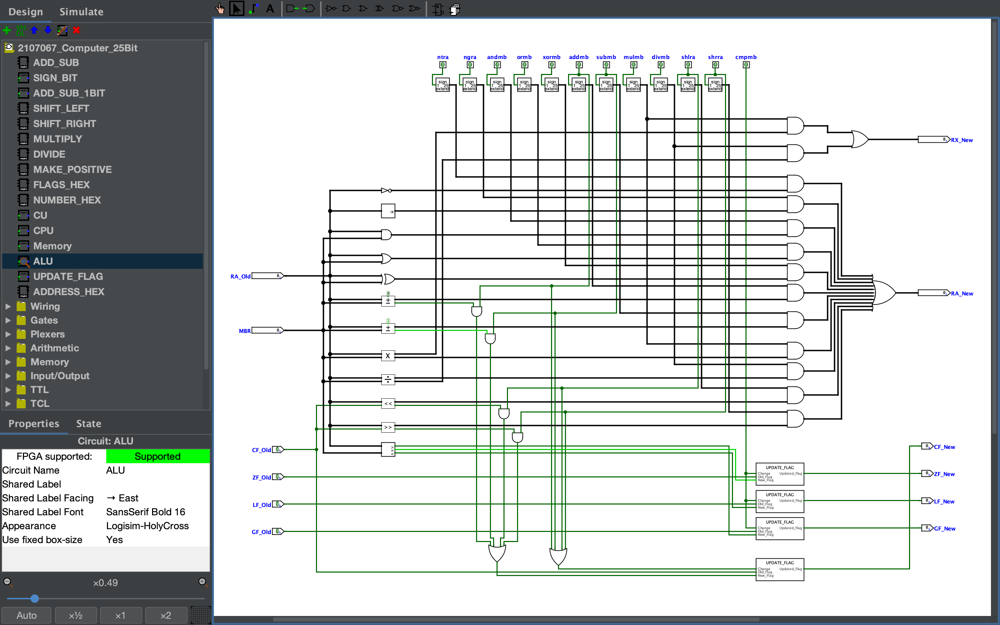
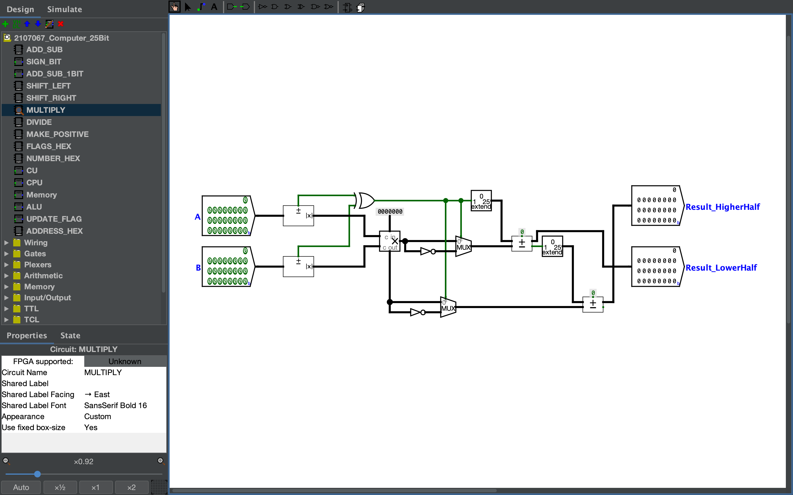
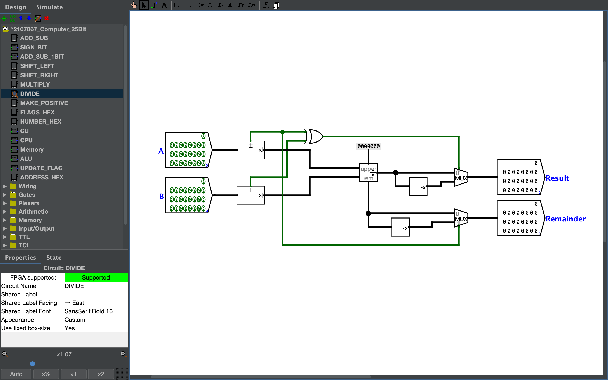
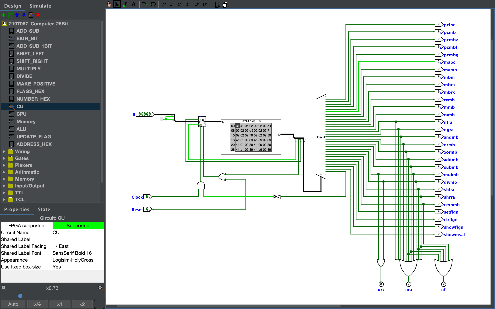
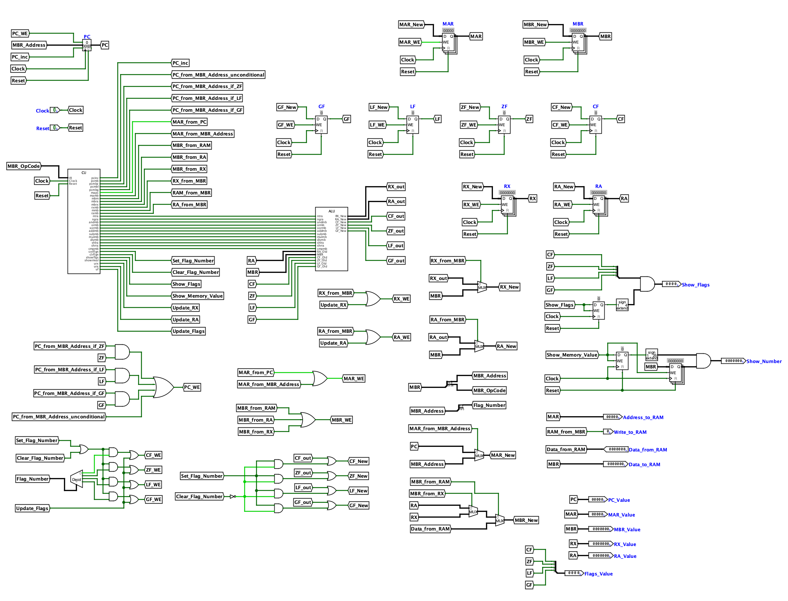
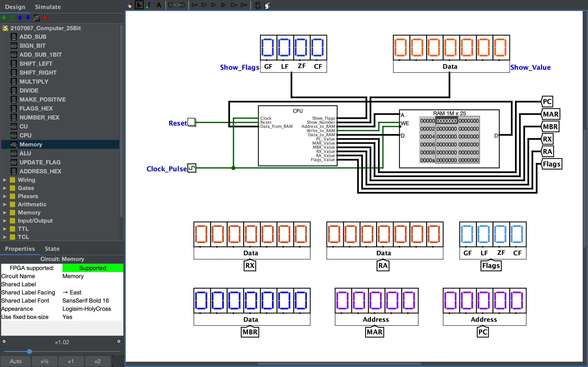

# Simple_Computer_25Bit

It's a **Simple Computer** that can load a program to perform several mathematical and logical operations. And, it's one of my **Academic Projects**.

## Please Pay Attention

- Please use 'Logisim Evolution' to Open the Circuit File.

- I have made a Translator to translate my program to the Machine Code that my Computer can work with

- Use 'translator.py' to translate program, if needed.

- To Translate / Compile:
  - python translator.py <source_file> <output_file>

---

**Project's Screen-Record:** [Drive Link to the Screen-Record](https://drive.google.com/file/d/1iLuADe-lf7iD0OSO_f_PVGhQZaHBNhHF/view?usp=sharing)

### ALU

|Multiply                           | Divide                          |
|-----------------------------------|---------------------------------|
| | |

### CU

### CPU

### Memory

---
