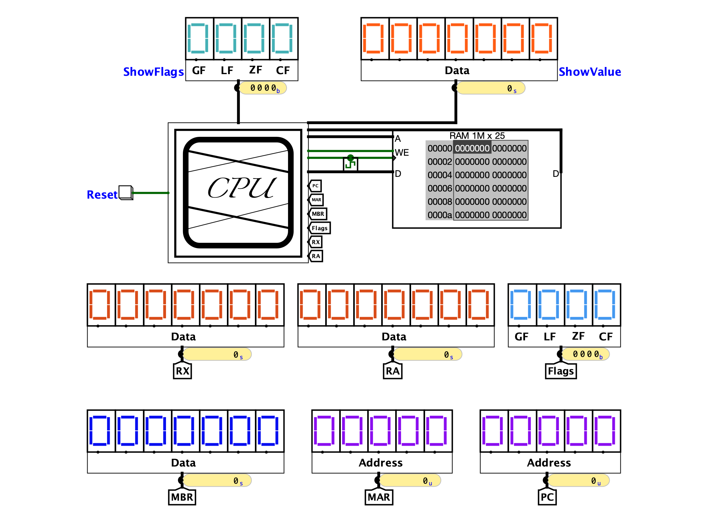
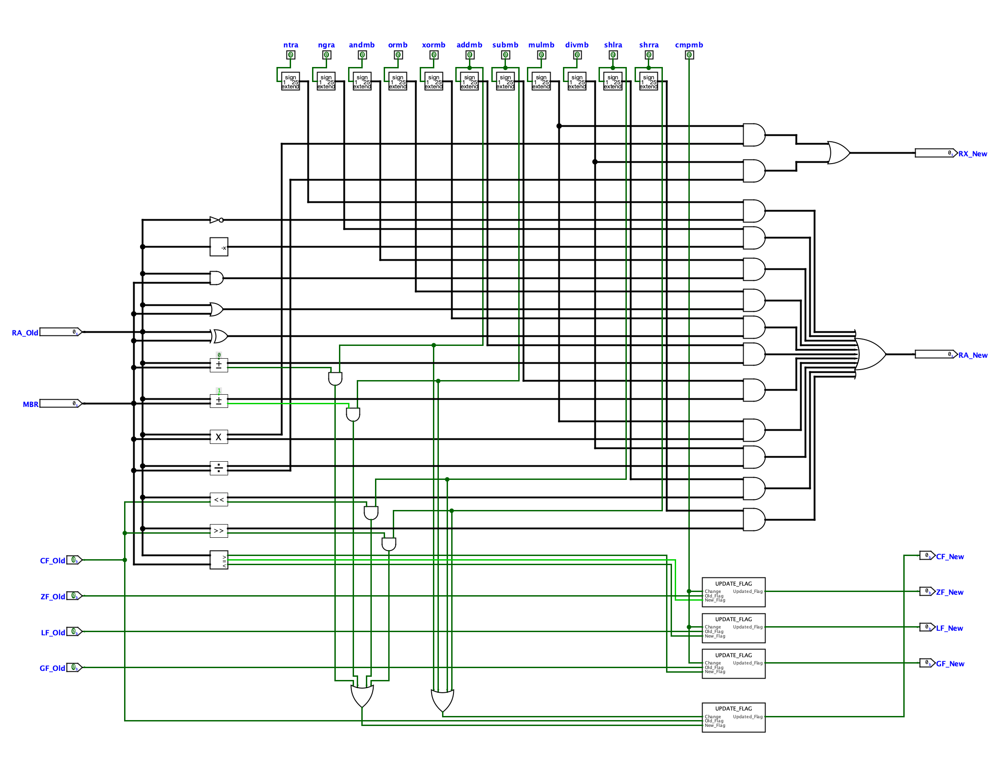

# Simple_Computer_25Bit

It's a `Simple Computer` that can load a program to perform several mathematical and logical operations. And, it's one of my `Academic Projects`.

## Please Pay Attention

- Use `Logisim Evolution` to Open the Circuit File.
- Use `translator.py` to translate program, if needed.
  - I've made this translator to translate a program to Machine Code that the Computer can work with.
- To Translate / Compile:
  - ```bash
    python translator.py <source_file> <output_file>
    ```
---

**Project-Demo:** [Project's Screen-Record](https://drive.google.com/file/d/1iLuADe-lf7iD0OSO_f_PVGhQZaHBNhHF/view?usp=sharing)

---

| Memory Interface | Central Processing Unit |
| ------ | --- |
|  |  |

| Control Unit | Arithmetic-Logic Unit |
| ------ | --- |
|  |  |

---
