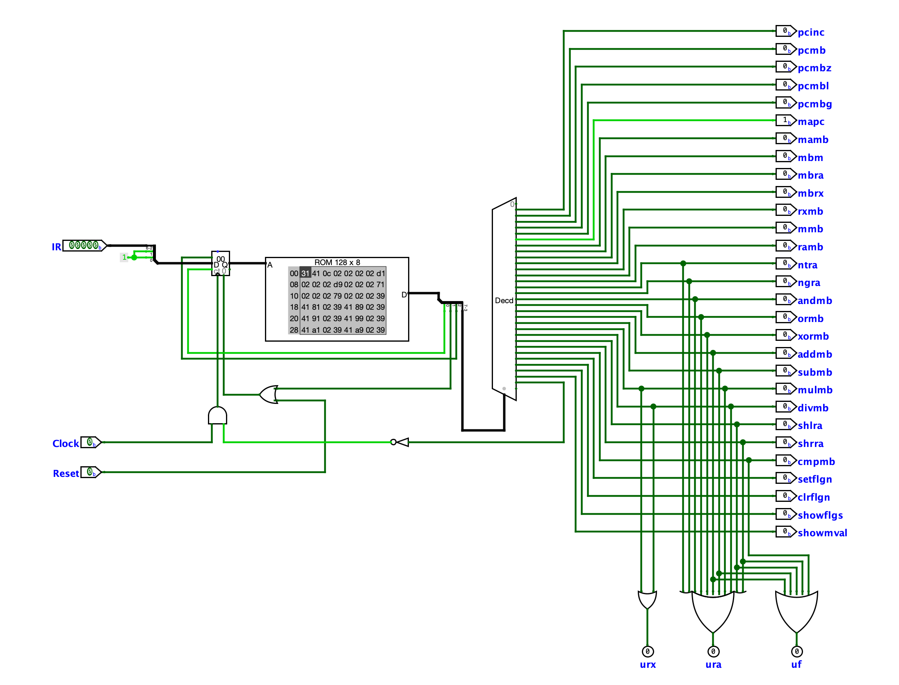

# Simple_Computer_25Bit

It's a `Simple Computer` that can load a program to perform several mathematical and logical operations. And, it's one of my `Academic Projects`.

## Please Pay Attention

- Use [`Logisim Evolution`](https://github.com/logisim-evolution/logisim-evolution) to Open the Circuit File.
- Use `translator.py` to translate program, if needed.
  - I've made this translator to translate a program to Machine Code that the Computer can work with.
- To Translate / Compile:
  - ```bash
    python translator.py <source_file> <output_file>
    ```
#

> **Project-Demo:** [Project's Screen-Record](https://drive.google.com/file/d/1iLuADe-lf7iD0OSO_f_PVGhQZaHBNhHF/view?usp=sharing)

---

## Language Rules

- Variable Declarations: `$variable_name`
- Variable Declarations with Value Assignments:
    - Decimal: `$variable_name = 123` or `$variable_name = #d123`
    - Hexadecimal: `$variable_name = #h7B`
    - Binary: `$variable_name = #b1111011`
- Label Declarations: `@label_name:`
- Variable Usage: `OpCode $variable_name`
    - Example: `ADD $variable_name`
- Label Usage: `OpCode @label_name`
    - Example: `JMP @label_name`
- Commentting:
    - Only single-line comments are allowed
    - Comment must be started with '!' character
        - Example: `! This is a comment`
    - A Comment can be added after the end of an instruction as well
        - Example: `ADD $x   ! add 'x' to RA-Register`

#

> **Please Check the `Examples` Folder for better understanding.**

#

## Instruction Set

| OpCode  | Binary  | Hex  | Operation Type | Description                           | Example             |
| ------- | ------- | ---- | ---------------| ------------------------------------- | ------------------- |
| `NOOP`  | `00000` | `00` | Unary          | No Operation                          | NOOP                |
| `SET`   | `00001` | `01` | Binary         | Set flag_number                       | SET x               |
| `CLR`   | `00010` | `02` | Binary         | Clear flag_number                     | CLR x               |
| `NOT`   | `00011` | `03` | Unary          | Bitwise Inversion                     | NOT                 |
| `NEG`   | `00100` | `04` | Unary          | Arithmetic Negation                   | NEG                 |
| `AND`   | `00101` | `05` | Binary         | Bitwise AND                           | AND memory_address  |
| `OR`    | `00110` | `06` | Binary         | Bitwise OR                            | OR memory_address   |
| `XOR`   | `00111` | `07` | Binary         | Bitwise XOR                           | XOR memory_address  |
| `ADD`   | `01000` | `08` | Binary         | Arithmetic Addition                   | ADD memory_address  |
| `SUB`   | `01001` | `09` | Binary         | Arithmetic Subtraction                | SUB memory_address  |
| `MUL`   | `01010` | `0A` | Binary         | Arithmetic Multiplication             | MUL memory_address  |
| `DIV`   | `01011` | `0B` | Binary         | Arithmetic Division                   | DIV memory_address  |
| `SHL`   | `01100` | `0C` | Unary          | Shift Left                            | SHL                 |
| `SHR`   | `01101` | `0D` | Unary          | Shift Right                           | SHR                 |
| `CMP`   | `01110` | `0E` | Binary         | Number Comparison                     | CMP memory_address  |
| `JMP`   | `01111` | `0F` | Binary         | Jump Unconditionally                  | JMP memory_address  |
| `JMPZ`  | `10000` | `10` | Binary         | Jump if Zero-Flag is 1                | JMPZ memory_address |
| `JMPL`  | `10001` | `11` | Binary         | Jump if Less-Flag is 1                | JMPL memory_address |
| `JMPG`  | `10010` | `12` | Binary         | Jump if Greater-Flag is 1             | JMPG memory_address |
| `INA`   | `10011` | `13` | Binary         | Copy Value from Memory to RA-Register | INA memory_address  |
| `INX`   | `10100` | `14` | Binary         | Copy Value from Memory to RX-Register | INX memory_address  |
| `OUTA`  | `10101` | `15` | Binary         | Copy Value from RA-Register to Memory | OUTA memory_address |
| `OUTX`  | `10110` | `16` | Binary         | Copy Value from RX-Register to Memory | OUTX memory_address |
| `SHOWF` | `10111` | `17` | Unary          | Show Flag-Values via Hex-Display      | SHOWF               |
| `SHOW`  | `11000` | `18` | Binary         | Show Memory-Value via Hex-Display     | SHOW memory_address |
| `HLT`   | `11001` | `19` | Unary          | Halts or Terminates the program       | HLT                 |

#

## Note
- `Unary Operations`:
  - These Operations are performed on a single Operand which is already present (or loaded from memory) in the `RA-Register`.
  - The Result is stored in the same Operand (RA-Register).
- `Binary Operations`:
    - These Operations are performed on two Operands.
    - The First Operand is always the `RA-Register`.
    - The Second Operand is loaded from the `memory_address` provided in the Instruction.
    - The Result is stored in the `RA-Register`.
- `JMP Operations`:
    - These Operations are used to Jump to a specific `memory_address` if the Condition is met.
    - The Condition is checked based on the Flags.
    - The `memory_address` is provided in the Instruction.
- `INX, INA, OUTX, OUTA`:
    - These Operations are used to Load / Store the Value from / to the Memory.
    - The `memory_address` is provided in the Instruction.
- `SHOWF, SHOW`:
    - These Operations are used to Show the Flag-Values / Memory-Value on the Hex-Display.
- `CMP`:
    - This Operation is used to Compare the Value in the `RA-Register` with the Value at the `memory_address`.
    - The Flags are set based on the Comparison.
- `SET, CLR`:
    - These Operations are used to Set / Clear the Flags.
    - The `flag_number` is provided in the Instruction.
    - The Flags are numbered as `0, 1, 2, 3` for `Carry, Zero, Less, Greater` respectively.
- `NOOP`:
    - This Operation is used to Generate a 4-Clock-Cycle Delay.
- `HLT`:
    - This Operation is used to Halt or Terminate the Program.

#

| Memory Interface | Central Processing Unit |
| ------ | --- |
|  |  |

| Control Unit | Arithmetic-Logic Unit |
| ------ | --- |
|  |  |

#
